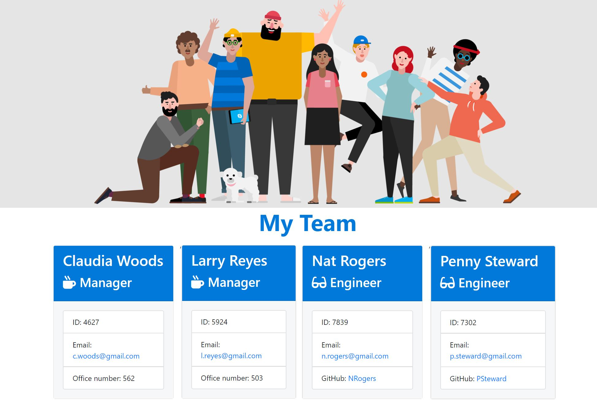
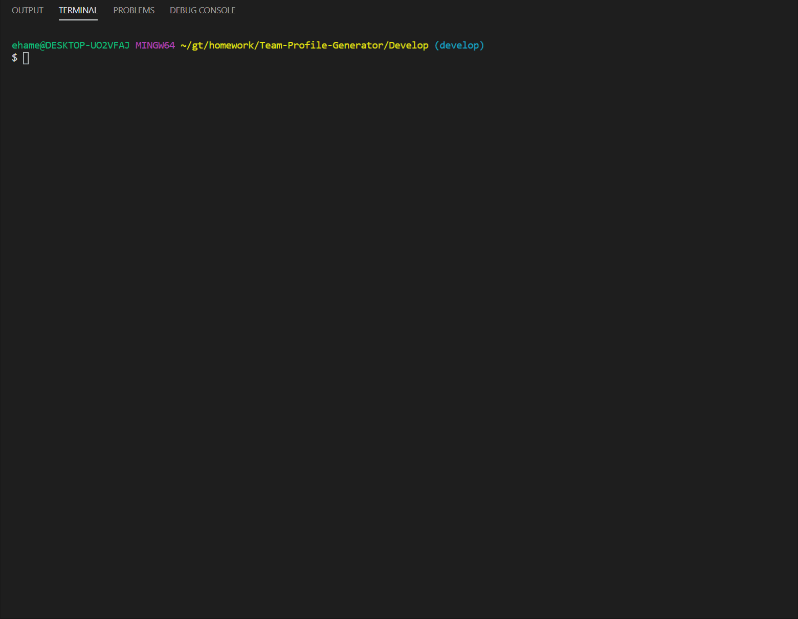

# Team Profile Generator 📊 CLI App using Inquirer and TDD with Jest

The application is designed to build a software engineering team generated through a node.js command line application. The application will prompt the user for information about the team and their information such as name, id, position, github, and email. The user can input any number of team members, and they may be a mix of engineers, managers and interns. This app was designed with Test Driven Development in mind. 

When the user has completed building the team, the application will create an HTML file in the output folder that displays the formatted team roster based on the information provided by the user. 


# Deployed Application

Try it out!

Navigate to the github repo
[Team Generator](https://github.com/Eshi44/Team-Profile-Generator)

    - Install Node
    - git clone the repo
    - run npm install
    - run 'node apps.js' inside the Develop folder 


# User Story

>As a USER, I want to generate a webpage that displays my team's basic info
so that I have quick access to emails and GitHub profiles.

# Acceptance Criteria

```
GIVEN I want to build a team
WHEN I input all required team info
THEN I should have access to a generated webpage with all team members info

```


# Technologies

- Animate.css
- Bootstrap
- HTML & CSS
- JavaScript
- Node.js
- NPM:
  - inquirer
  - jest


# Preview

>

>


# Test Driven Development Preview


>

